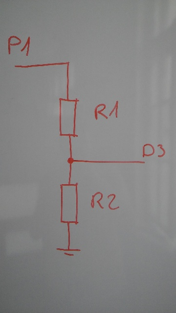

This is the Internet of Shit device part.

## Hardware

- Application processor: [WEMOS D1 mini][d1-mini] with [NodeMCU][nodemcu]
  firmware.

- Sensor: Shinyei PPD42NS ([datasheet][ppd42ns]).

Schematic:



- P1 is from PPD42NS (look in the datasheet)
- D3 is a GPIO pin of D1 mini
- Values of R1 and R2 should be that `R2/(R1+R2) ~ 4/3.3` (PPD42NS outputs 4V,
  and ESP8266's maximum input voltage is 3.3V. TODO: measure this once I find
  the damn oscilloscope).
  I use `R1 = 2.2K, R2 = 2.2K` out of plain laziness, but it probably causes
  problems.

## Running

D1 mini has a builtin USB/serial converter. Both AT commands for flashing
firmware and Lua shell uses this serial line, so no other cables are needed.

1. Connect D1 mini to your computer.

    ```
    $ lsusb | grep QinHeng
    Bus 003 Device 064: ID 1a86:7523 QinHeng Electronics HL-340 USB-Serial adapter
    $ ls -l /dev/ttyUSB0
    crw-rw---- 1 root uucp 188, 0 Mar 31 11:29 /dev/ttyUSB0
    ```

2. Give yourself permissions

    Quick'n'dirty way:

    ```
    sudo chmod a+rw /dev/ttyUSB0
    ```

3. Flash the firmware

    ```
    ./esptool write_flash 0 nodemcu_float_master_20170329-1935.bin
    ```

4. Verify that it works

    ```
    $ screen /dev/ttyUSB0 115200
    ```

    Now press RESET. The following should appear:

    ```
    NodeMCU 2.0.0 build unspecified powered by Lua 5.1.4 on SDK 2.0.0(656edbf)
    init.lua ver 1.2
    set mode=STATION (mode=1)
    MAC:    a0:20:a6:06:87:16
    chip:   427798
    heap:   40064
    > 
    ```

    You should be able to type Lua commands:

    ```
    > print('test')
    test
    ```

    Close the screen session (`C-a k`) so that it doesn't interfere with `luatool`.

6. Upload and run the program

    ```
    ./luatool --verbose --baud 115200 --dofile --echo
    ```

    It should periodically (every 30 seconds) print out three values:
    - amount of time the input was low (t0)
    - amount of time the input was high (t1)
    - Low Pulse Occupancy (LPO) (`t0 / (t0 + t1)`)

    See the datasheet for information about how to deduce particle concentration
    from LPO.

## Related materials

- [D1 mini documentation][d1-mini]
- [NodeMCU documentation][nodemcu]
- [PPD42NS datasheet][ppd42ns]
- [Field calibrations of a low-cost aerosol sensor at a regulatory monitoring site in California][field-calibrations]

[d1-mini]: https://www.wemos.cc/product/d1-mini.html
[nodemcu]: https://nodemcu.readthedocs.io/en/master/
[ppd42ns]: http://web.archive.org/web/20140911065722/http://www.sca-shinyei.com/pdf/PPD42NS.pdf 
[field-calibrations]: http://www.kirkrsmith.org/publications/2014/04/30/field-calibrations-of-a-low-cost-aerosol-sensor-at-a-regulatory-monitoring-site-in-california

## External files used

- `../tools/luatool` from <https://github.com/4refr0nt/luatool>
- `../tools/esptool` from <https://github.com/espressif/esptool>
- `nodemcu_float_master_20170329-1935.bin` built from
  <https://github.com/nodemcu/nodemcu-firmware> using
  [marcelstoer/nodemcu-build](https://hub.docker.com/r/marcelstoer/nodemcu-build/)
  Docker image
